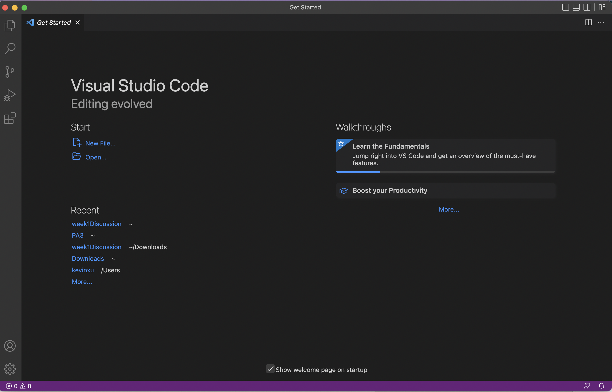

# Week 1 Lab Report

## How to log into a course-specific account on ieng6 (Remotely Connecting)
### Step 1: Download Visual Studio Code (if you don't already have it)
Go to [Link](https://code.visualstudio.com/), and follow the instructions to download and install it on your computer. Download the version that corresponds to your computer, i.e. if you have a mac, install the mac version, otherwise you'll run into problems. When it is installed, it should open a window that looks like this when opened.


### Step 2: Connect Remotely
Open the terminal on Visual Studio Code and use the ssh command along with your course specifc-account. Look up your course-specific account here:[https://sdacs.ucsd.edu/~icc/index.php](https://sdacs.ucsd.edu/~icc/index.php) you'll have to set your password and wait a couple minutes.

This is what the command you're typing in should look like. 
```
$ ssh cs15lwi23zz@ieng6.ucsd.edu
```

If this is  the first time you’ve connected to the server, you'll probably get a message like this:
```
⤇ ssh cs15lwi23zz@ieng6.ucsd.edu
The authenticity of host 'ieng6.ucsd.edu (128.54.70.227)' can't be established.
RSA key fingerprint is SHA256:ksruYwhnYH+sySHnHAtLUHngrPEyZTDl/1x99wUQcec.
Are you sure you want to continue connecting (yes/no/[fingerprint])? 
```

Type yes and press enter, and then type in your password; the interaction should look like this (for my computer specifically, the password doesn't come up as you type it, you may run into the same problem but don't worry because the client still receives the password)

```
# On your client
⤇ ssh cs15lwi23zz@ieng6.ucsd.edu
The authenticity of host 'ieng6-202.ucsd.edu (128.54.70.227)' can't be established.
RSA key fingerprint is SHA256:ksruYwhnYH+sySHnHAtLUHngrPEyZTDl/1x99wUQcec.
Are you sure you want to continue connecting (yes/no/[fingerprint])? 
Password: 
```

If you've succesfully logged in, you should see something like this:


Your terminal is now connected to a computer in the CSE basement, any command you run will run on that computer. 

### Step 3: Running Some Commands
Try running commands you learned about in class like ls, pwd, and cd on your computer and the remote computer. 

Some useful commands to try:
* cd ~
* cd
* ls -lat
* ls -a
* ls <directory> where <directory> is /home/linux/ieng6/cs15lwi23/cs15lwi23abc, where the abc is one of the other group members’ username
* cp /home/linux/ieng6/cs15lwi23/public/hello.txt ~/
* cat /home/linux/ieng6/cs15lwi23/public/hello.txt
  
  
Here is an example of me executing some of the commands:


I was able to figure out and get more comfortable with the commands just by trying different commands out. For example, I figured out what ls -lat does by simply typing it into the terminal, and saw that it posted directories with dates and times, which tells me that the command ls -lat lists directories/files by date. 


