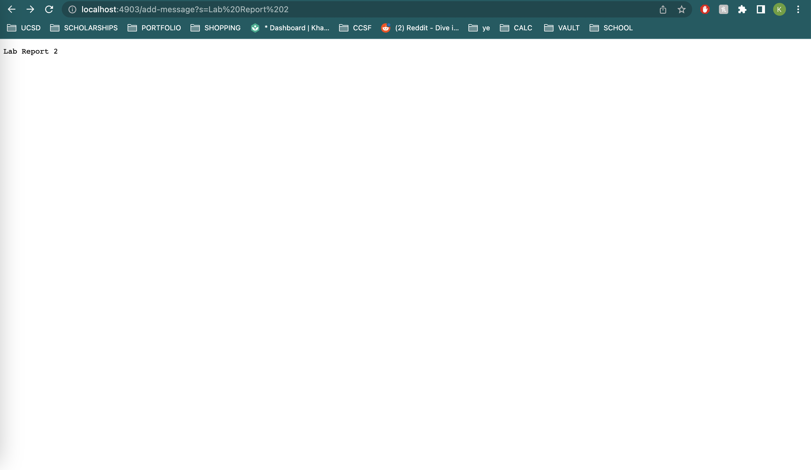

# Week 2 Lab Report

## Part 1: StringServer
### Here is the code for my StringServer.

### Example of using the incoming request /add-message

The method that was called as a response to the incoming request was String handleRequest(URI url) which took in the request (the url) and executed according to the conditions of the request. The argument relevant to this method is the url method that the user inputs. In my example, the argument is: http://localhost:4903/add-message?s=Lab%20Report%202. The value of entireString is relevant here since at the start of the web server, the value of entireString is an empty string: ""; however, when the request is exectued, the value of entireString becomes "Lab Report 2" + a new line (\n).
### Additional use of the incoming request: /add-message

The method that was called as a response to the incoming request was again String handleRequest(URI url). This example is mostly similar to the last, except the argument relevant to this method is a new url: http://localhost:4903/add-message?s=Hello, which means a string, "Hello",  is added to entireString, as well as another new line (\n). 

## Part 2: Working through the Array Methods Bug in Lab 3 (methods: reverseInPlace, reversed)
### Failure-inducing input for the buggy programs
```
@Test
public void testReverseInPlace1(){
  int[] input2 = {1, 2, 3};
  ArrayExamples.reverseInPlace(input2);
  assertArrayEquals(new int[]{3, 2, 1}, input2);
  }

@Test
public void testReversed1(){
  int[] input2 = {32, 12, 73 , 23};
  assertArrayEquals(new int[]{23, 73, 12, 32}, ArrayExamples.reversed(input2));
  }
```
### Inputs that don't induce a failure for the buggy programs
```
@Test
public void testReverseInPlace() {
    int[] input1 = { 3 };
    ArrayExamples.reverseInPlace(input1);
    assertArrayEquals(new int[]{ 3 }, input1);
	}
  
 @Test
  public void testReversed() {
    int[] input1 = { };
    assertArrayEquals(new int[]{}, ArrayExamples.reversed(input1));
  }
```

### Symptoms of the buggy program, as output of running the above tests/inputs
Output of the input that doesn't induce failures. 


Output of the input that did induce failures in our two buggy methods. 


### Change required to fix the buggy code (before and after)
Before:
```
	static void reverseInPlace(int[] arr) {
		for(int i = 0; i < arr.length; i += 1) {
      			arr[i] = arr[arr.length - i - 1];
			}
		}
	static int[] reversed(int[] arr) {
		int[] newArray = new int[arr.length];
		for(int i = 0; i < arr.length; i += 1) {
			arr[i] = newArray[arr.length - i - 1];
		}
		return arr;
	}
```
After:
```
	static void reverseInPlace(int[] arr) {
		int tempArr[] = new int[arr.length];
		for(int i = 0; i < arr.length; i += 1) {
			tempArr[i] = arr[arr.length - i - 1];
		}
    		for(int i = 0; i < arr.length; i += 1){
      			arr[i] = tempArr[i];
    		}
  	}
  
  	static int[] reversed(int[] arr) {
    		int[] newArray = new int[arr.length];
    		for(int i = 0; i < arr.length; i += 1) {
      			newArray[i] = arr[arr.length - i - 1];
    		}
    	return newArray;
  	}
```
Adjustments for the method reverseInPlace: I created a temporary array to copy the reverse elements of arr, and then implemented a for loop to replace the values at each index of arr with the corresponding index in the temporary array. What was happening in the unfixed version of the code was that the method would work on the first half of the inputted items, but wouldn't work on the second half. By creating a temporary array, we could add the reversed elements of the inputted array without having to worry about prior values. 

Adjustments for the method reversed: I changed arr[i] to newArray[i], newArray[arr.length - i - 1] to arr[arr.length - i - 1], then returned the newArray instead of arr. The unfixed version of the reversed method incorrectly replaces arrays value with the newly created newArray, which just gave us an array of 0s. Instead, updating newArray with the reversed elemnts of arr and returning newArray gave me the output I wanted. 

## Additional things I learned from labs 2 and 3
I learned that you could lauch a web server from a remote connection, such as the ieng remote connection. To access this web server, instead of the local host url, it would look this: ieng6-201.ucsd.edu:3000 (3000 being the input port number). I also learned that the * command tells javac to compile all the .java files in the currect directory. As the writeup said: it’s a shorthand for writing all the files out, which is a useful notation to use whenever I have several Java files to compile.
