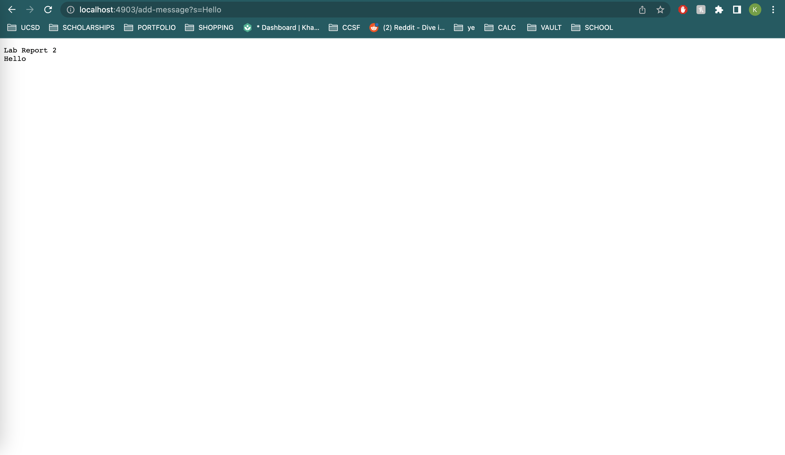

# Week 2 Lab Report

## Part 1: StringServer
### Here is the code for my StringServer.

### Example of using the incoming request /add-message

The method that was called as a response to the incoming request was String handleRequest(URI url) which took in the request (the url) and executed according to the conditions of the request. The argument relevant to this method is the url method that the user inputs. In my example, the argument is:(http://localhost:4903/add-message?s=Lab%20Report%202) The value of entireString is relevant here since at the start of the web server, the value of entireString is an empty string ""; however, when the request is exectued, the value of entireString becomes "Lab Report 2" + a new line (\n).
### Additional use of the incoming request /add-message

The method that was called as a response to the incoming request was again String handleRequest(URI url). This example is mostly similar to the last, except the argument relevant to this method is a new url: (http://localhost:4903/add-message?s=Hello), which means a string, "Hello",  is added to entireString, as well as another new line (\n). 

## Part 2: 
