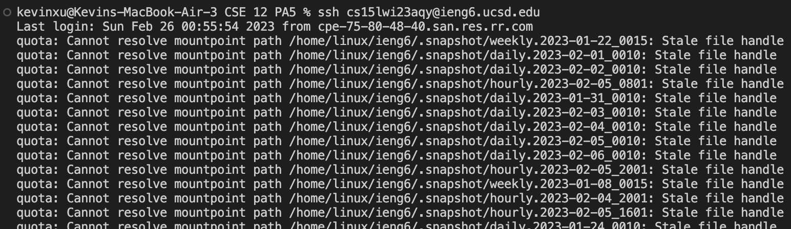
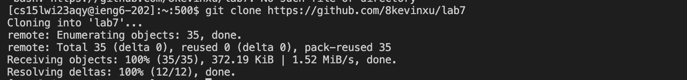
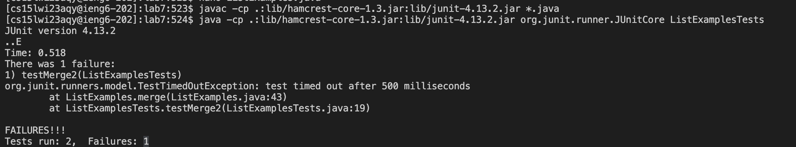
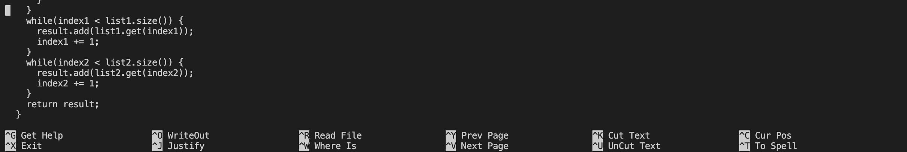
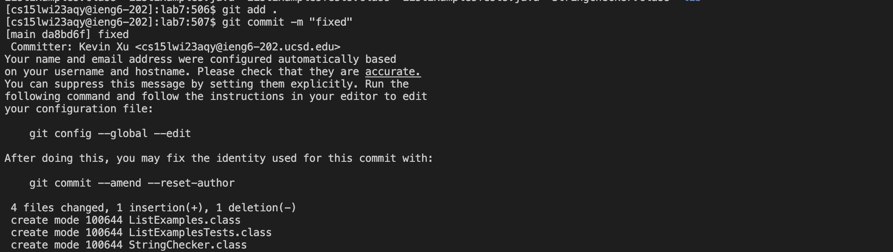
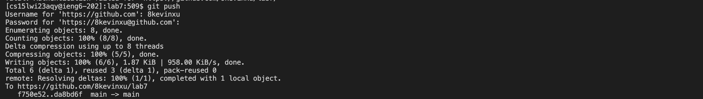

# Lab Report 4
## Step 4 - Log in to ssh


```
Keys pressed: <ctrl+r> <s> <s> <h> <enter>

```

The ssh cs15lwi23aqy@ieng6.ucsd.edu command was accessed using ctrl r, and then typing in "ssh", and pressing enter. 

## Step 5 - Clone your fork of the repository from your Github account


```
Keys pressed: <g><i><t><space><c><l><o><n><e><space><ctrl+v><enter>

```
I typed the command git clone out, and pasted the copied link of the forked repository on Github.

## Step 6 - Run the tests, demonstrating that they fail


```
Keys pressed: <ctrl+r><c><d><l><enter><ctrl+r><j><a><v><a><c><enter>,<ctrl+r><j><a><v><a><ctrl+r><ctrl+r><enter>

```


## Step 7 - Edit the code file to fix the failing test


```
Keys pressed: <ctrl+r><n><a><enter> (scrolled down>) <right><backspace><2><ctrl+o><enter><ctrl+x>

```

I used ctrl+r and typed na to get the nano ListExamples.java command. When I entered the command, the command line editor popped up, so I scrolled down and found the error, used my right arrow key, and fixed the error. To save, I used ctrl+o, and to exit I used ctrl+x.

## Step 8 - Run the tests, demonstrating that they now succeed


```
Keys pressed: <ctrl+r><j><a><v><a><ctrl+r><ctrl+r><enter>,<ctrl+r><j><a><v><a><ctrl+r><ctrl+r><ctrl+r><enter>
```
I used ctrl+r, typed java, and pressed ctrl+r 2 times to find the command that compiles the tester. (javac -cp .:lib/hamcrest-core-1.3.jar:lib/junit-4.13.2.jar *.java), and then pressed ctrl+r 3 times to get the command to run the tests (java -cp .:lib/hamcrest-core-1.3.jar:lib/junit-4.13.2.jar org.junit.runner.JUnitCore ListExamplesTests.java).

## Step 9 - Commit and push the resulting change to your Github account_



```
Keys pressed: <g><i><t><space><a><d><d><space<.><enter>,<g><i><t><space><c><o><m><m><i><t><space><-><m><space><"><f><i><x><e><d><enter>,<g><i><t><p><u><s><h> 
```
I typed the command git add . out which added changes to the Git staging area. Next, I typed the git commit -m "fixed" command out to commit the changeds and set the description "fixed" to those changes. Finally, I typed the git push command out to push the changes to GitHub. 
