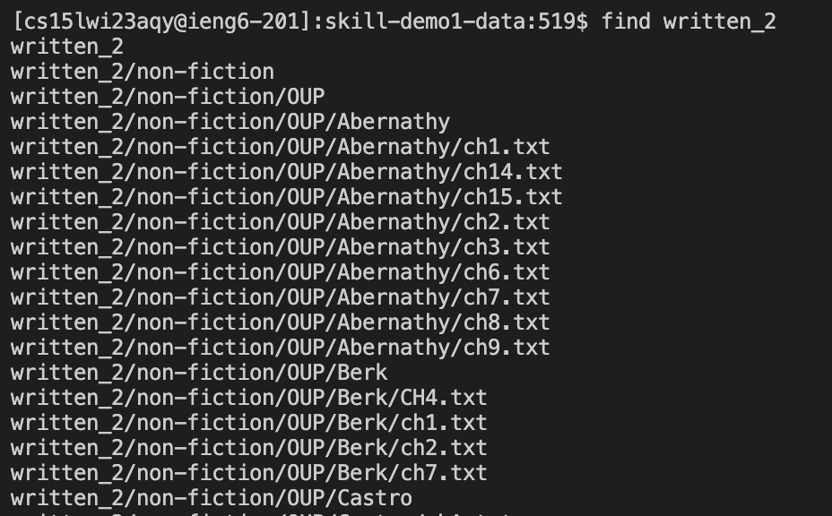

# Lab Report 5

## Set up
For context, I will be exploring find's command line options using the same files as used in Lab Report 3. From lab report 3: I used find on the directory 
written_2 to save all of its contents to a file find-results.txt. This was so that I could use grep on find-results.txt since grep, by default, 
only searches the content of files, it cannot search the contents of a directory itself. 


## Find's command line options
Here's what happens when I use the find command with the written_2 directory without any command line options. 


In this example, the find command returns all of the directories and files within the written_2 directory, the screenshot doesn't include all the output
to save space in this report. 

### find's -type option
With find's -type option, we can tell the find command to look for files of a specific types, such as 'f' for regular files, or 'd' for directories.

Here is an example of the -type d option being used with find. 
```
find written_2 -type d
written_2
written_2/non-fiction
written_2/non-fiction/OUP
written_2/non-fiction/OUP/Abernathy
written_2/non-fiction/OUP/Berk
written_2/non-fiction/OUP/Castro
written_2/non-fiction/OUP/Fletcher
written_2/non-fiction/OUP/Kauffman
written_2/non-fiction/OUP/Rybczynski
written_2/travel_guides
```

With the -type d option for find, we're able to look for files in written_2 that are directories, whereas the regular find command gave us files of every type.
This -type d option of find is useful for finding the directories within a directory. 

Here is another example of the -type option, this time with the -type f
```
find written_2 -type f 
written_2/non-fiction/OUP/Abernathy/ch1.txt
written_2/non-fiction/OUP/Abernathy/ch14.txt
written_2/non-fiction/OUP/Abernathy/ch15.txt
written_2/non-fiction/OUP/Abernathy/ch2.txt
written_2/non-fiction/OUP/Abernathy/ch3.txt
written_2/non-fiction/OUP/Abernathy/ch6.txt
written_2/non-fiction/OUP/Abernathy/ch7.txt
written_2/non-fiction/OUP/Abernathy/ch8.txt
written_2/non-fiction/OUP/Abernathy/ch9.txt
written_2/non-fiction/OUP/Berk/CH4.txt
... more files
```
With the -type f option for find, all regular files are returned. I didn't include the entire output here since the output was really long due to written_2 having a lot of regular files.
The -type f option of find is useful for finding the regular files within a directory. The -type option is useful in general because it allows us to specify what the type of what
we're looking for when using the find option. Useful when you want to only look for files, or only look for directories. 
For this command option, I consulted chatGPT for help on how it worked, how it's used, and why it could be useful. 

### find's -name option
Find's -name option allows us to find files/directories that match the same pattern.

Here's an example of using find's -name option to find the files/directories with the pattern California.
```
find written_2 -name "California*"
written_2/travel_guides/berlitz2/California-History.txt
written_2/travel_guides/berlitz2/California-WhatToDo.txt
written_2/travel_guides/berlitz2/California-WhereToGo.txt
```

With the -name option, we're able to find the files/directories with a specific pattern, in this case it's California. The * is a wildcard character that matches any sequence of characters.
In this case, the * allows us to find all files/directories containing "California(anything after [*])". The -name option here is useful to look for files/directories
with a specific pattern, in this case it's "California".

Here's another example of find's name option with a different pattern
```
find written_2 -name "Intro*"
written_2/travel_guides/berlitz1/IntroDublin.txt
written_2/travel_guides/berlitz1/IntroEdinburgh.txt
written_2/travel_guides/berlitz1/IntroEgypt.txt
written_2/travel_guides/berlitz1/IntroFWI.txt
written_2/travel_guides/berlitz1/IntroFrance.txt
written_2/travel_guides/berlitz1/IntroGreek.txt
written_2/travel_guides/berlitz1/IntroHongKong.txt
written_2/travel_guides/berlitz1/IntroIbiza.txt
written_2/travel_guides/berlitz1/IntroIndia.txt
written_2/travel_guides/berlitz1/IntroIsrael.txt
written_2/travel_guides/berlitz1/IntroIstanbul.txt
written_2/travel_guides/berlitz1/IntroItaly.txt
written_2/travel_guides/berlitz1/IntroJamaica.txt
written_2/travel_guides/berlitz1/IntroJapan.txt
written_2/travel_guides/berlitz1/IntroJerusalem.txt
written_2/travel_guides/berlitz1/IntroLakeDistrict.txt
written_2/travel_guides/berlitz1/IntroLasVegas.txt
written_2/travel_guides/berlitz1/IntroLosAngeles.txt
written_2/travel_guides/berlitz1/IntroMadeira.txt
written_2/travel_guides/berlitz1/IntroMadrid.txt
written_2/travel_guides/berlitz1/IntroMalaysia.txt
written_2/travel_guides/berlitz1/IntroMallorca.txt
```
Using the -name option, we're able to find all files/directories with the pattern "Intro" in it. The -name option for the find command is useful because it allows us to
look for the files and directories that have a certain pattern within the directory we're searching for. The name options makes searching for specific patterns
within a directory easier. 
For this command option, I consulted chatGPT for help on how it worked, how it's used, and why it could be useful. 

### find's -mtime option
Find's -mtime option allows us to find files modified before or aftera  certain time. You can use -mtime +n to find files modified more 
than n days ago, and -mtime -n to find files modified less than n days ago.

Here's an example of the find -mtime option which looks for files modified more than 20 days ago:
```
find written_2 -mtime +20
written_2
written_2/non-fiction
written_2/non-fiction/OUP
written_2/non-fiction/OUP/Abernathy
written_2/non-fiction/OUP/Abernathy/ch1.txt
written_2/non-fiction/OUP/Abernathy/ch14.txt
written_2/non-fiction/OUP/Abernathy/ch15.txt
written_2/non-fiction/OUP/Abernathy/ch2.txt
written_2/non-fiction/OUP/Abernathy/ch3.txt
written_2/non-fiction/OUP/Abernathy/ch6.txt
written_2/non-fiction/OUP/Abernathy/ch7.txt
... more files
```
Here, the -mtime +20 option of find allows us to find files and directories modified more than 20 days ago. There were more files in the output since most of the files and directories within
this dirrectory were last modified more than 20 days ago, but they weren't included to save space. 

Here's an example of the -mtime option which looks for files modified less than 10 days ago
```
find written_2 -mtime -10
```
There is no output after the command, since no files or directories were modified within the last 10 days. 
The -mtime option for the find command is useful for finding files or directories modified within a certain time frame. -mtime is useful if
you want to look for old, or maybe new files. 
For this command option, I consulted chatGPT for help on how it worked, how it's used, and why it could be useful. 

### find's -size option
Find's -size option allows us to look for files that are of a certain size. 

Here's an example of find's -size option to look for files smaller than 2 kilobytes. 
```
find written_2 -size -2k
written_2/travel_guides/berlitz1/HandRIbiza.txt
written_2/travel_guides/berlitz1/HandRIstanbul.txt
```
The "-2" part of the command specifies that we're looking for a file less than 2, and the "k" indicates the indicated size, kilobytes. We're returned in the
output 2 files which are the only two files in the directory writte_2 that have a size smaller than 2 kilobytes.

Here's another example of find's -size option, this time to look for files larger than certain size.
```
find written_2 -size +85k
written_2/non-fiction/OUP/Berk/CH4.txt
written_2/non-fiction/OUP/Berk/ch1.txt
written_2/non-fiction/OUP/Berk/ch2.txt
written_2/non-fiction/OUP/Kauffman/ch8.txt
written_2/travel_guides/berlitz1/WhereToDublin.txt
written_2/travel_guides/berlitz1/WhereToFrance.txt
written_2/travel_guides/berlitz1/WhereToIndia.txt
written_2/travel_guides/berlitz1/WhereToIstanbul.txt
written_2/travel_guides/berlitz1/WhereToItaly.txt
written_2/travel_guides/berlitz1/WhereToJapan.txt
written_2/travel_guides/berlitz1/WhereToMalaysia.txt
written_2/travel_guides/berlitz2/Canada-WhereToGo.txt
written_2/travel_guides/berlitz2/China-WhereToGo.txt
written_2/travel_guides/berlitz2/Portugal-WhereToGo.txt
```
The "+85k" part of the command species that we're looking for files of a size greater than 85 kilobytes, and we're returned all files that satisfy this condition.
The -size option of the find command is useful to look for files and directories of different sizes within a directory, this is important because you might need
to identify smaller or larger files within a directory. For this command option, I consulted chatGPT for help on how it worked, how it's used, and why it could be useful. 
